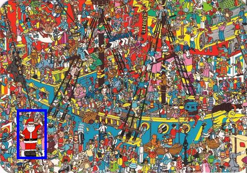
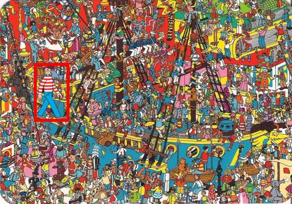
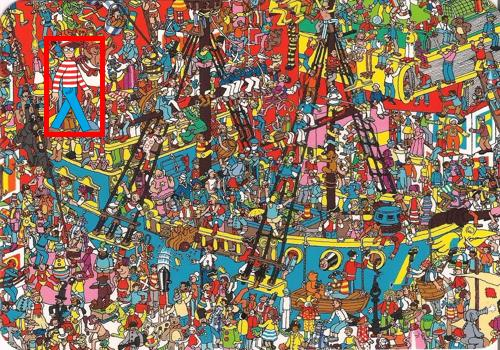

# Waldo and Santa Detection Project

This project utilizes a Convolutional Neural Network (CNN) to identify and locate Waldo and Santa in images. The CNN model outputs images with detected objects surrounded by colored bounding boxes—red for Waldo and blue for Santa.

## Project Overview

The project employs a CNN model trained to distinguish between complex backgrounds and the characters. It's designed to be robust against variations in positioning and scaling.

## Output Examples

Below are some examples of the model's output:

### Santa Detected

*The image above shows the CNN model identifying Santa with a blue bounding box.*

### Waldo Detected

*The image above shows the CNN model identifying Waldo with a red bounding box.*

## How It Works

The system processes input images through several layers of the CNN, extracting features and applying learned filters to determine the presence and locations of the characters. After detection, the system annotates the original image with bounding boxes.

## References

- [Finding Waldo Using a Simple Convolutional Neural Network](https://medium.com/analytics-vidhya/finding-waldo-using-a-simple-convolutional-neural-network-1604cb4d2e55) - This article provides insights into similar approaches using CNNs for object detection in images.
  
